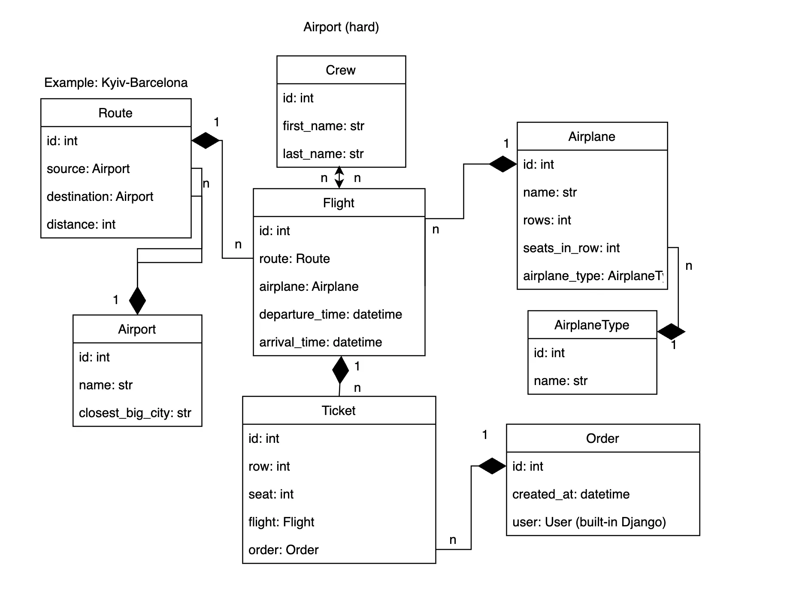
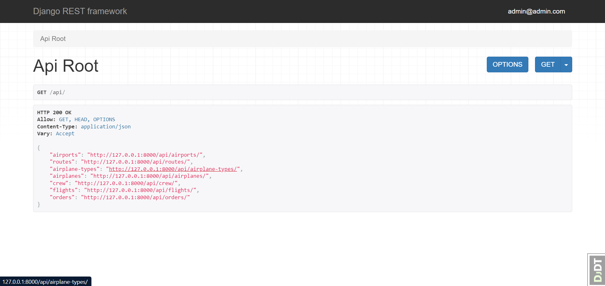
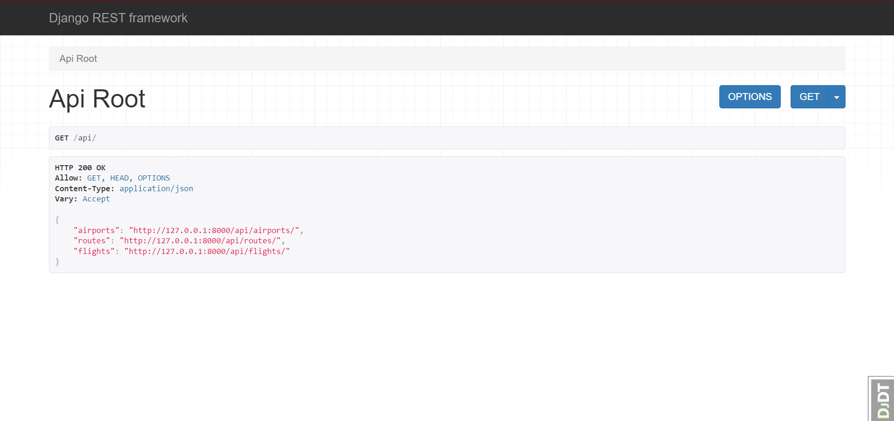
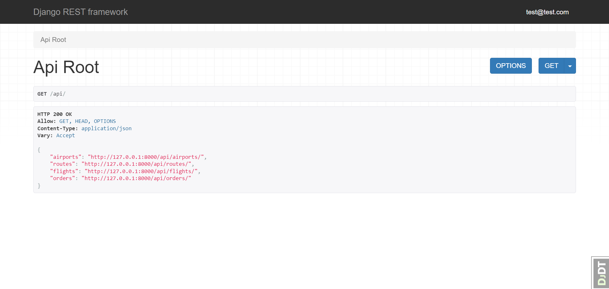
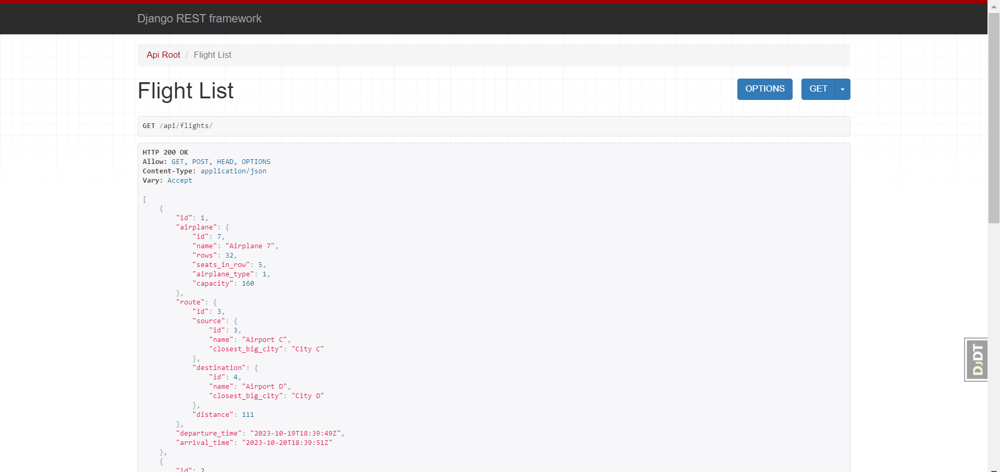

# ✈️ Airport Service API
___
Welcome to the **Airport Service API**, a powerful Django REST Framework project designed to manage airport-related data and services with ease.

## Description  📝
The **Airport Service API** is your gateway to efficient airport data management. Whether you're building a flight booking application, an airport management system, or any aviation-related project, our comprehensive API simplifies the process. It offers robust features to handle airport information, flight data, user management, and more.

## Getting Started 🚀
___

### Installing via GitHub ⚙️

- Python 3 must be installed
- Create .evn using .env.sample
- Specify `DB_TYPE=sqlite` inside .env to be able to run localy
- Run these commands:
  ```shell
  git clone https://github.com/eduardhabryd/airport-service-drf-project.git
  cd airport-service-drf-project
  python -m venv venv
  source venv/bin/activate # or venv\Scripts\activate in Windows
  pip install -r requirements.txt
  python manage.py migrate
  python manage.py loaddata data.json # to load test data
  python manage.py runserver
  ```

## Run with Docker 🐳
___

To run the project using Docker, follow these steps:

- Install Docker if it's not already installed. You can download it [here](https://www.docker.com/products/docker-desktop)
- Create a .env file using .env.sample and specify DB_TYPE=postgres inside the .env to run the project with Docker.
- Run the following command to build and start the Docker containers:
```shell
docker-compose up --build
```

## Access Details 🔐
___

For testing purposes, you can use the following test user credentials:

- Login: `test@test.com`
- Password: `test@test.com`


To interact with the API, follow these endpoints:

- Create a user account: /api/user/register/
- Obtain an access token: /api/user/token


## Features  🌟
___

### Users 👥

The API supports different user types with varying capabilities:

- Anonim User: Can view Routes, Airports, and Flights but can't create anything. Registration is available at /api/user/register/.

- Authenticated User: Can view Routes, Airports, Flights, and their Orders, as well as create new orders.

- Admin User: Has full access, including create, update, and delete privileges for most resources (except Orders).

- API endpoints available on the root view are specific to the user type (Anonim, Authenticated, Admin).

### Additional Features  🛠️
- JWT Token implementation is available on the following endpoints:
  - /api/user/token/
  - /api/user/token/refresh/

- Usernames are disabled, and email addresses are used for user identification.

- DRF Spectacular is integrated and accessible at:
  - /api/schema/
  - /api/doc/swagger/ 
  - /api/doc/redoc/

- Filtering is available for Flights based on source and destination.

## DB Structure 🗄️
___



## Demo
___
### Admin API Root

### Anonim API Root

### Authenticated API Root

### Flight List
