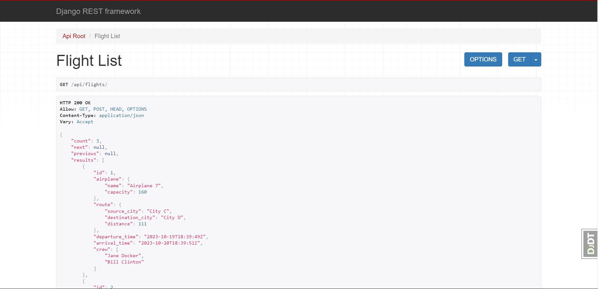

# Airport Service API DRF Project

Django REST Framework Project for Airport Service

## Installing via GitHub
```shell
git clone https://github.com/eduardhabryd/airport-service-drf-project.git
cd airport-service-drf-project
python -m venv venv
source venv/bin/activate # or venv\Scripts\activate in Windows
pip install -r requirements.txt
python manage.py migrate
python manage.py loaddata data.json # to load test data
python manage.py runserver
```

## Access Details

Test User:
```
login: test@test.com
password: test@test.com
```

- create user on the following endpoint:
    - api/user/register/
- get access token on the following endpoint:
    - api/user/token


## Features

### Users
- Anonim User:
  - Can see Routes, Airports and Flights
  - Can't create anything
  - Anonim User can register an account on the following endpoint:
    - api/user/register/

- Authenticated User:
  - Can see Routes, Airports, Flights, and his Orders
  - Can create orders

- Admin User:
  - Can see all instances
  - Can create everything, also, update and delete everything except for Orders

- In API Root View availiable only enpoints that are allowed for specific user type (Anonim, Authenticated, Admin)

### Additional Features
- JWT Token Implemented on the following endpoints:
  - /api/user/token/
  - /api/user/token/refresh/

- Username was disabled and Email was used instead

- DRF Spectacular was added and is available on the following endpoints:
  - api/schema/
  - api/doc/swagger/
  - api/doc/redoc/

- Filtering on source and destination for Flights

## Demo
### Admin API Root

### Anonim API Root

### Authenticated API Root

### Flight List
